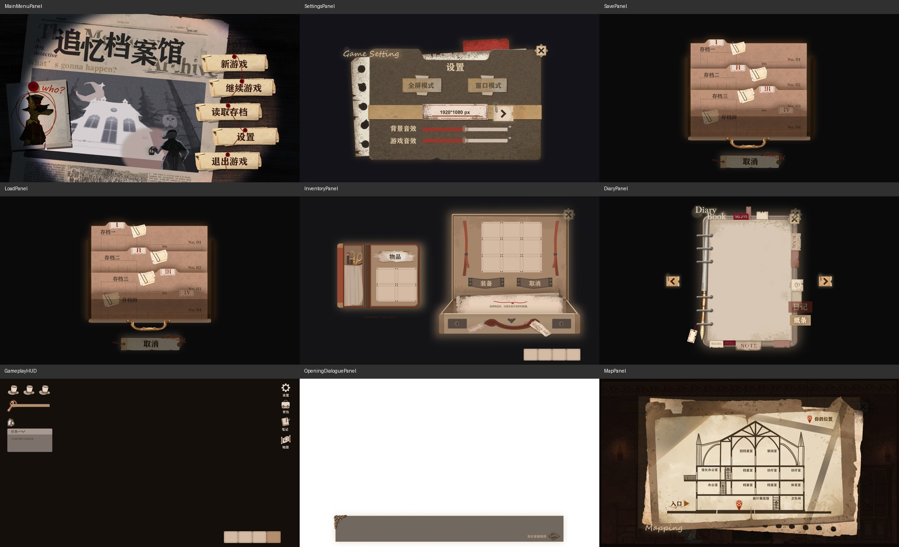
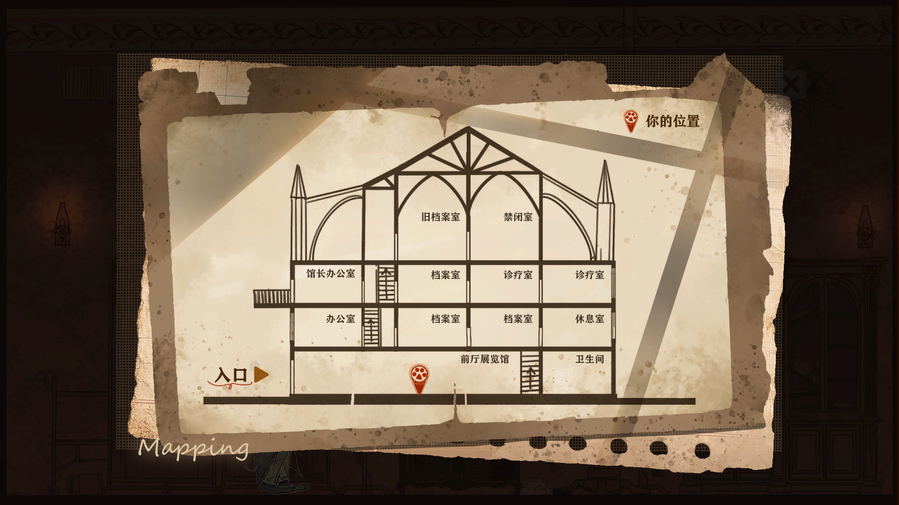

# UI2.0 替换结果与未决项

日期：2026-09-09。资源实际目录为 `Assets/Art/UI/Imported_UI2.0/UI2.0`。本轮由 Luna max 子 agent 分批实现，批次完成后集中验收；修改已写入 prefab，未提交 Git。

## 已完成

| 范围 | 实际结果 |
| --- | --- |
| 封面、开始游戏、系统、设置 | 核对定位图并执行迁移；补齐继续游戏入口、去除旧标题、显示红绳；修正设置滑杆拉伸和分辨率去重。新游戏确认页与系统页保存后无新增差异。 |
| 存档、读档 | SavePanel / LoadPanel 已保存 UI2.0 布局、槽位和取消按钮，沿用现有存档逻辑。 |
| HUD | 游戏页面素材已保存到 GameplayHUD，保留生命、能量、快捷栏、副手格及导航引用。 |
| OpeningStory | 按本轮用户明确要求，将自白页话框和继续提示用于 OpeningDialoguePanel；保留 CG、肖像、打字机、音效与原有转场。移除误接到 HUD 的无发布者自白通路。 |
| 背包、快捷栏 | 保留已符合定位图的组合布局，清除装备/取消按钮的旧文字叠加及快捷栏重复提示；运行时代码不再重新生成这些旧标签。 |
| 日记、地图 | 保存新底图、页签、翻页/关闭绑定；日记正文仍由后续真实数据提供。 |
| 道具图标 | 替换 13 个有明确同名对应关系的 ItemConfig 图标；没有根据相似名称替换手提灯等不确定项。 |

## 地图代码

MapPanel 订阅已有 SceneLoaded / RoomEntered / RoomExited 事件；位置来自 prefab Inspector 配置。已配置四层走廊/楼梯、前厅与九个现有房间，共 14 个 SceneId。房间定位依据用户两张场景图和现有场景；没有修改场景跳转，也没有把相邻房间视作直连。

点位使用 UI2.0 底图的左下原点归一化坐标，显示当前房间/楼层的代表位置，不是角色在房间内的连续世界坐标。重新打开或启用面板时同步当前场景，避免旧点残留；未知场景隐藏动态标记。右上“你的位置”为美术图例。

## 验证证据及边界

- 所有相关迁移通过 Unity MCP 执行，实际 prefab 已保存。
- 最终 17 个 UI prefab 均未发现缺失脚本、失效对象引用或缺少 CanvasRenderer，见 `UI2.0-validation/prefab-reference-check.json`。
- Unity 内执行代码逐一验证 14 个场景的 marker 锚点及未知场景隐藏；另验证首次打开、room 事件、关闭后跨场景再打开和未知场景重新启用。
- 实际 Unity 离屏渲染检查了主要面板与前厅动态标记，见下方验收图。最后 Console 查询为 0 条日志。
- 上述是编辑器内组件验证和 prefab 渲染，不代表完整 Play Mode/真机验收。真实存档写入恢复、音量读写、分辨率切换、按钮 hover，以及全流程剧情/背包交互仍需实际游戏验证。

## 拿不准、保持未改的内容

- 教程页 1/2/3：尚无可靠的图片与现有 GuideOverlayPanel 步骤/键位对应表，未擅自套用。
- 剧情页、普通对话页及角色肖像：本轮没有确定的新宿主/角色映射；OpeningStory 已按要求使用自白页。带“AI参考”的 CG 不当作最终替代资源。
- 新字体：素材目录只有标准图与说明，缺少可导入字体文件，保留现有字体回退。
- 地图旧档案室、禁闭室、露台：没有本轮确认的对应 SceneId，未添加猜测映射。
- HUD 任务栏缺少真实任务数据/展开行为，保留既有占位；日记正文缺少运行时数据，未编造内容。
- 背包左侧独立关闭入口、部分相似名称道具缺少明确映射，保持原行为；现有拖拽状态提示予以保留。

各面板细节见同目录 `UI2.0-menu-notes.md`、`UI2.0-hud-notes.md`、`UI2.0-story-notes.md`、`UI2.0-inventory-notes.md`、`UI2.0-diary-map-notes.md`。

## 清理

完成后清理 `.ui2-work`（旧预览、临时脚本、MCP 会话、bin/obj）和根目录遗留的定位图副本、字体标准副本及 `_tmp_map_*` 对比图。正式素材、迁移脚本、验收记录和用户已有无关改动保留。
